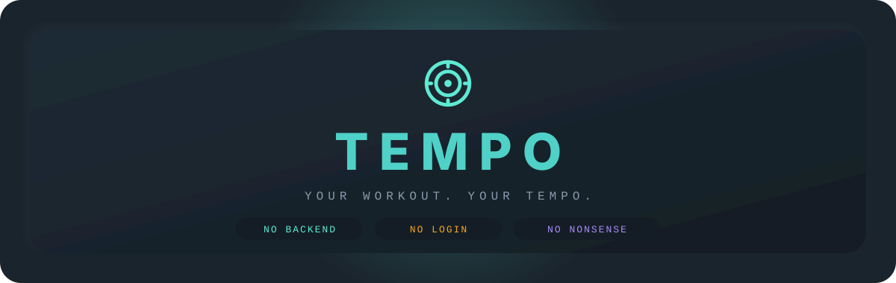
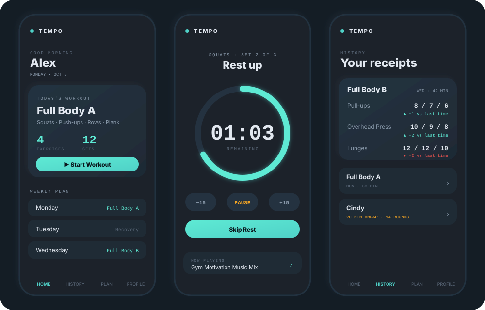

<div align="center">



<br>


### A tiny coach that lives in your browser.
**It counts your sets. It nags you to rest. It plays your hype music. It never asks you to log in.**

[**🚀 Quick Start**](#-quick-start) · [**✨ Features**](#-whats-inside) · [**📋 Bring Your Plan**](#-bring-your-own-plan) · [**💾 Your Data**](#-where-does-my-data-live) · [**🙋 FAQ**](#-faq-aka-questions-youre-about-to-ask)

</div>

<br>

## 👀 Sneak peek

<div align="center">
  
  <br>
  <sub>Dark, soft, a little bit squishy-looking. Neumorphism, but make it gym.</sub>
</div>

<br>

## 🤔 What even is this?

**TEMPO is one HTML file** that turns any workout plan into a guided, set-by-set experience.

You bring the plan *(or use the starter)*. TEMPO brings the **timers**, the **beep**, the **history**, and the **beats**.

No backend. No framework. No build step. No "we've updated our privacy policy" emails. Just you, your phone, and a rest timer that is **extremely** judgmental about you scrolling Instagram between sets.

<br>

## 🚀 Quick Start

> **Time required:** about 30 seconds. We timed it. (We have a timer. It's a whole thing.)

| | Step | What happens |
|:-:|------|--------------|
| **1** | 📂 Open `tempo.html` in any browser | Chrome, Safari, Firefox, Edge. Phone or desktop. |
| **2** | ✍️ Type your name in the popup | That's the entire signup. Yes, really. |
| **3** | ▶️ Tap **Start Workout** → **Start Set** | The coaching begins. |
| **4** | 💪 Do the reps → tap **Done** | The rest timer starts counting. |
| **5** | 🔔 *Beep.* | Rest is over. Go again. |

That's it. You're training. 🎉

<br>

## ✨ What's inside

<table>
<tr>
<td width="50%" valign="top">

### ⏱️ Set-by-set coaching
Start Set → timer → reps → Done → rest → next set. TEMPO walks you through every single one, so your brain can focus on the heavy thing instead of the counting.

</td>
<td width="50%" valign="top">

### 🔔 Rest timer + beep
Countdown with **+15 / −15 / Pause / Skip**. Beeps *and* vibrates when time's up. Built with the Web Audio API, so there are zero sound files to download.

</td>
</tr>
<tr>
<td valign="top">

### 📊 Per-set tracking
`Pull-ups: 7 / 6 / 5`, with durations for each set. See exactly where the fatigue kicks in. Never squashed into one sad average.

</td>
<td valign="top">

### 🔄 Resume after refresh
Refreshed mid-workout? Closed the tab by accident? Phone died? TEMPO saves as you go and shows a yellow banner: **Resume** or **Discard**.

</td>
</tr>
<tr>
<td valign="top">

### 🏆 Cindy AMRAP mode
20-minute countdown, round counter, finish-early option. Saved as its own special entry in your history. May cause swearing.

</td>
<td valign="top">

### 🎵 Built-in music player
Paste any YouTube link and it plays in-app. Comes pre-loaded with motivational mixes. A mini now-playing bar floats during workouts.

</td>
</tr>
<tr>
<td valign="top">

### 🔗 Form-video links
Attach a YouTube tutorial, form image, or video URL to any exercise. They show up as tappable chips mid-workout. Because "am I doing this right?" deserves a fast answer.

</td>
<td valign="top">

### 📜 History with deltas
Tap any past workout to expand every set. **Green** means you beat last time, **red** means... tomorrow is another day.

</td>
</tr>
<tr>
<td valign="top">

### 🤖 Thursday smart backup
Thursday checks which sessions you missed this week and suggests the catch-up. Or you can just rest. No judgment. (Some judgment.)

</td>
<td valign="top">

### 📤 Full backup
Export **everything** (profile, plan, history, settings, music) as a single JSON. Import it on a new device and lose nothing.

</td>
</tr>
</table>

<br>

## 🎨 Make it yours

<table>
<tr>
<td width="33%" valign="top" align="center">

### 🌈 Pick your vibe
**Profile → Accent Color**

      

7 presets plus a custom picker for literally any hex code. Cyan not your thing? Go orange. Go pink. Go wild.

</td>
<td width="33%" valign="top" align="center">

### 🌗 Dark or light
**Profile → Theme**

One toggle. Remembers your choice. Dark mode for the 6 AM gym, light mode for people who enjoy sunlight.

</td>
<td width="33%" valign="top" align="center">

### 📱 Install as an app
**Profile → Install**

Or use your browser menu → *"Install app"* / *"Add to Home Screen"*. Full-screen, app-like, and no app store required.

</td>
</tr>
</table>

<br>

## 📋 Bring your own plan

The starter plan is a deliberately generic **3-day full-body split** (Mon / Wed / Fri, with recovery days in between). Swap it for anything. Three ways:

<details open>
<summary><b>✏️ Option A: Edit it in the app</b> <i>(easiest)</i></summary>

<br>

**Plan tab** → tap a day → rename exercises, change sets, add / remove / reorder, attach form-video links → hit **Save Plan**. Done.

</details>

<details>
<summary><b>🤖 Option B: Ask an AI to build it</b> <i>(lazy, but in a smart way)</i></summary>

<br>

Copy this prompt into ChatGPT, Claude, or Gemini, then edit the first line to describe what *you* want:

```text
Make me a workout plan as JSON in this exact format:

{
  "format": "tempo-workout-plan",
  "version": 1,
  "name": "My Plan",
  "description": "5-day hypertrophy split",
  "days": [
    {
      "id": "monday",
      "day": "Monday",
      "workoutName": "Push Day",
      "type": "strength",
      "exercises": [
        { "id": "benchpress", "name": "Bench Press", "sets": 4, "restSeconds": 120, "type": "strength", "note": "Controlled tempo" },
        { "id": "overheadpress", "name": "Overhead Press", "sets": 3, "restSeconds": 90, "type": "strength", "note": "Strict press" }
      ]
    }
  ]
}

Use the same structure for all 7 days (monday through sunday).
Each day needs: id, day, workoutName, type (strength / rest / cindy),
and exercises (each with id, name, sets, restSeconds, type, note).
Exercise type can be "strength" or "timed" (for things like planks).
For rest days: type = "rest", exercises = [], and add a restNote field.
```

Save the reply as `my-plan.json`, then go to **Option C**. 👇

</details>

<details>
<summary><b>📥 Option C: Import a JSON file</b></summary>

<br>

**Plan tab** → **Import Plan** → pick your `.json` file → preview → confirm. Your profile and history stay **completely untouched**.

</details>

<details>
<summary><b>🎁 Sharing a plan with friends</b></summary>

<br>

**Plan tab** → **Download Plan**.

The file contains **only the program**: no name, no history, no personal data. Send it to anyone, they hit **Import Plan**, and their data stays theirs. Congratulations, you're now a personal trainer.

</details>

<br>

## 💾 Where does my data live?

In your browser's `localStorage`. Six keys, all neatly separated:

| Key | What's inside |
|-----|---------------|
| `cb_profile_v2` | Your name + creation date |
| `cb_plan_v2` | Your workout plan |
| `cb_history_v2` | Every completed workout (per-set reps + durations) |
| `cb_active_v2` | The in-progress workout (powers the Resume banner) |
| `cb_settings_v2` | Sound / vibration / theme / accent color |
| `cb_music_v2` | Your music playlist |

Nothing expires. Nothing leaves your device.

> 💡 **Pro tip:** Clearing your browser data also clears TEMPO. Hit **Profile → Export All Data** once in a while and keep that file somewhere safe. Future-you will be very grateful.

<br>

## 🔒 Privacy (the short, boring, wonderful version)

| | |
|---|---|
| ✅ | Zero tracking, zero analytics, zero cookies |
| ✅ | Zero external API calls *(except YouTube, if you play music)* |
| ✅ | Your data never leaves your device unless **you** export it |
| ✅ | No account, no login, no email |
| ✅ | **Reset Application** wipes everything instantly |

<br>

## 🌐 Browser support

| Browser | Minimum version |
|---------|:---------------:|
| Chrome / Edge | 90+ |
| Firefox | 88+ |
| Safari (desktop + iOS) | 14+ |
| Chrome Android | 90+ |

JavaScript required. No frameworks. No dependencies. (Okay, YouTube, for the music. That's it.)

<br>

## 🙋 FAQ (a.k.a. questions you're about to ask)

<details>
<summary><b>Do I need to create an account?</b></summary>
<br>
No. There is no account. There is no server to keep an account on. TEMPO is a file. You opened the file. That's the relationship.
</details>

<details>
<summary><b>Does it work without internet?</b></summary>
<br>
Yes, 100% offline for everything except the music player (YouTube needs, you know, YouTube). Timers, tracking, history, and plan editing all work in airplane mode, in a basement gym, or in the middle of a forest.
</details>

<details>
<summary><b>I switched phones. Did I lose everything?</b></summary>
<br>
Only if you never exported. On the old phone: <b>Profile → Export All Data</b>. On the new one: <b>Profile → Import All Data</b>. Everything comes along, including your playlist.
</details>

<details>
<summary><b>I refreshed the page in the middle of a set. Am I doomed?</b></summary>
<br>
Nope. TEMPO saves your workout state continuously. Look for the yellow banner on the home screen and tap <b>Resume</b>.
</details>

<details>
<summary><b>The beep didn't beep.</b></summary>
<br>
Check three things: the sound toggle in <b>Profile</b> (and the speaker icon up top), your phone's silent mode, and your media volume. Browsers also like you to tap the page at least once before they allow audio, and starting a set counts.
</details>

<details>
<summary><b>Can I use it for running / yoga / swimming / competitive cheese rolling?</b></summary>
<br>
It's built around sets, reps, and rest, so it shines for strength and bodyweight training. Timed exercises (like planks) work too. For the cheese rolling, you're on your own.
</details>

<details>
<summary><b>Will you add cloud sync?</b></summary>
<br>
It's on the wishlist as an <i>optional, opt-in</i> thing. TEMPO will never make you create an account just to do a push-up.
</details>

<br>

## 📁 Files

```text
tempo.html      ← The app (~175 KB, single file). This is the whole thing.
manifest.json   ← PWA manifest
icon-192.png    ← App icon (small)
icon-512.png    ← App icon (large)
icon-32.png     ← Favicon
README.md       ← You are here 📍
assets/         ← Banner + preview images for this README
```

Open `tempo.html` and you're done. The other files only matter if you want the **install as app** feature to work.

<br>

## 🤝 Contribute

This is open. Fork it, break it, improve it. PRs welcome.

| | |
|---|---|
| 🐛 **Found a bug?** | Open an issue. Bonus points for steps to reproduce. |
| 💡 **Got an idea?** | Start a discussion. |
| 🔧 **Want to add a feature?** | Send a PR. |
| 📝 **Better jokes for this README?** | Edit this README. We *will* judge them. |

**Ideas worth exploring:**

- [ ] ⚖️ Body-weight tracking
- [ ] 📈 Weekly volume charts
- [ ] 🔥 Workout streaks / habit tracking
- [ ] 🚴 Rest-day cardio logging
- [ ] 📚 Exercise library with auto-complete
- [ ] ☁️ Optional, opt-in cloud sync

<br>

## 📄 License

Do whatever you want with it. Modify it. Share it. Sell it *(please don't, but technically you can)*. Attribution appreciated, not required.

<br>

<div align="center">


**Your workout. Your tempo.**

<sub>Built with vanilla HTML · CSS · JavaScript. No frameworks, no build step, no nonsense.</sub>

</div>
